<p align="center">
  <a href="#" target="blank"></a>
</p>

<p align="center">Disciline Frontend</p>
<p align="center">

## Description

Disciline adalah aplikasi Sistem Informasi Pelanggaran Siswa (SIPS) yang bertujuan untuk mencatat, mengelola, dan melaporkan pelanggaran yang dilakukan siswa di lingkungan sekolah.

- **Version :** v1.0.0
- **Developer :** Rumah Kodingku
- **Released On :** July 04, 2024
- **Status :** Stable Release
- **Contact :** [rumahkodingku45@gmail.com](mailto:rumahkodingku45@gmail.com)

## Contents

1. [Description](#description)
2. [System Requirements](#system-requirements)
3. [Tech Stack](#tech-stack)
4. [Installation](#installation)
5. [Setup Environment Variable](#setup-environtment-variable)
6. [Features](#features)
7. [Running the App](#running-the-app)
8. [Screenshots](#screenshots)

## System Requirements

- Linux, Windows or MacOS
- Node.js v14 or later
- MySQL 5.7 or later
- npm (Node Package Manager)

## Tech Stack

- Next JS
- TypeScript
- Tailwind CSS
- RizzUI

## Installation

```bash
# Navigate to project repository
$ cd disciline_frontend

# Install all dependencies
$ npm install or pnpm install
```

## Setup Environment Variable

```bash
# Change name file
$ cp .env.example .env

# Environment
API_URL= # Your API URL
```

## Features

- Authentication & Authorization
- Update Password
- CRUD (Create, Read, Update, Delete) Agama
- CRUD (Create, Read, Update, Delete) Tipe Pelanggaran
- CRUD (Create, Read, Update, Delete) Status
- CRUD (Create, Read, Update, Delete) Jabatan
- CRUD (Create, Read, Update, Delete) Golongan
- CRUD (Create, Read, Update, Delete) Pendidikan
- CRUD (Create, Read, Update, Delete) Jurusan
- CRUD (Create, Read, Update, Delete) Guru
- CRUD (Create, Read, Update, Delete) Kelas
- CRUD (Create, Read, Update, Delete) Siswa
- CRU (Create, Read, Update) Pelanggaran

## Running The App

```bash
# development mode
$ npm run dev or pnpm run dev
```

## Screenshot

### Homepage

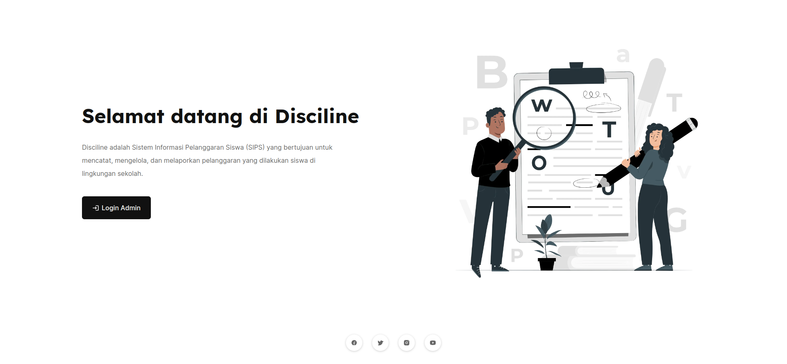

### Login Admin

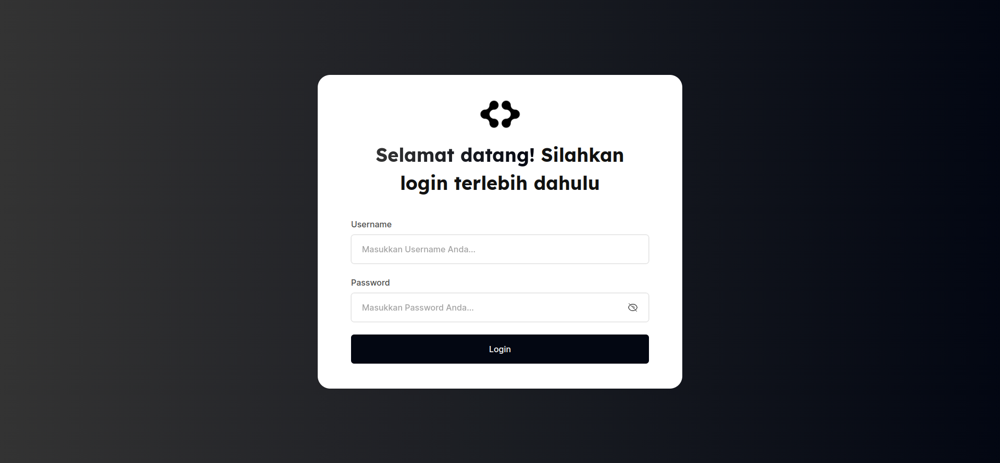

### Dashboard Admin

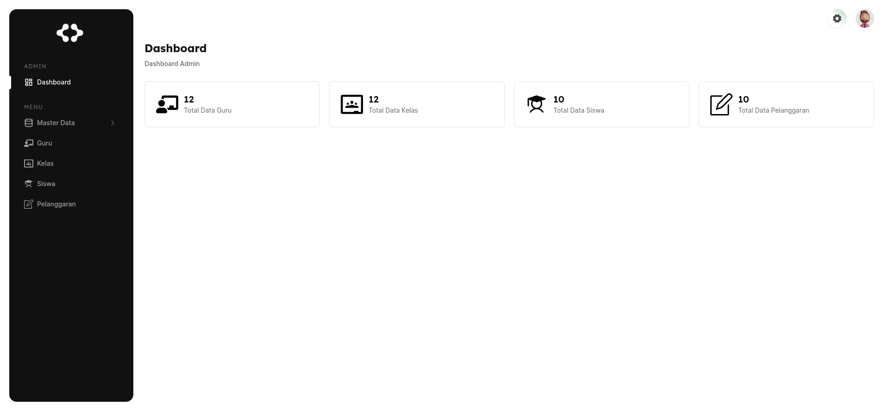

### Master Data | Agama

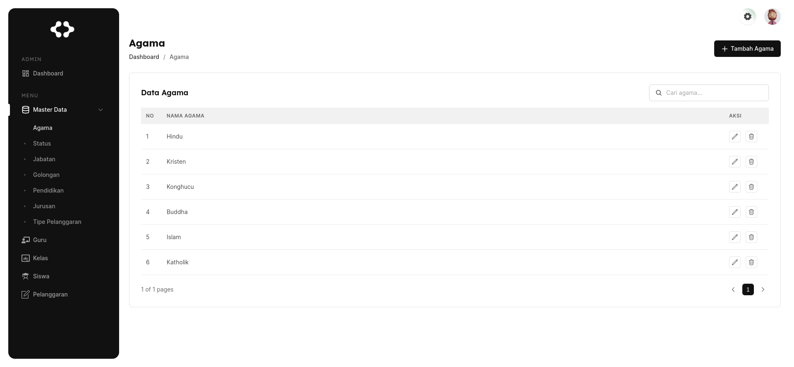

### Master Data | Status

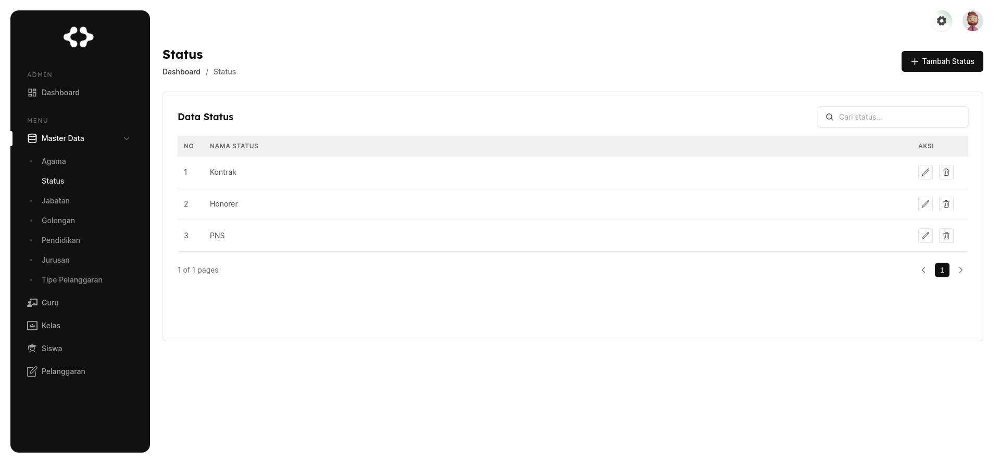

### Master Data | Jabatan

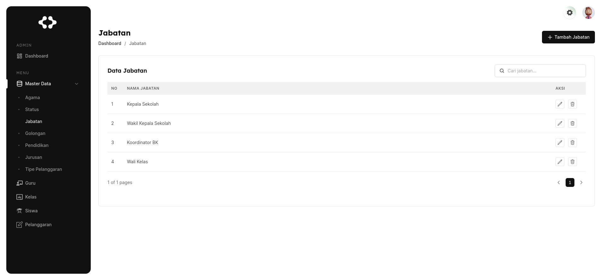

### Master Data | Golongan

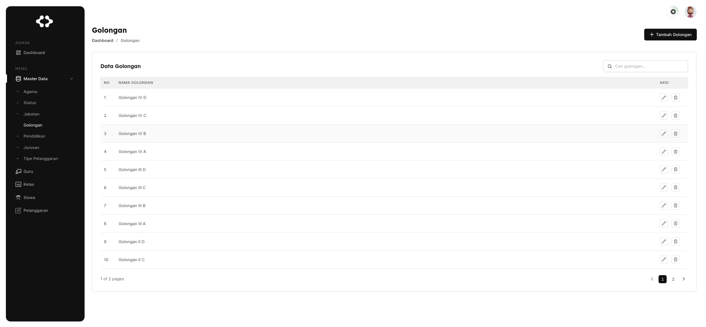

### Master Data | Pendidikan


### Master Data | Jurusan

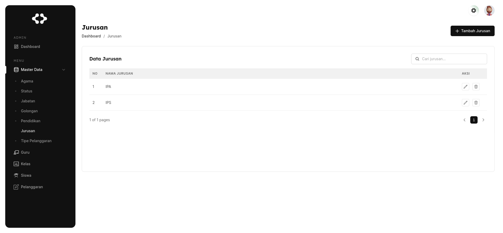

### Master Data | Tipe Pelanggaran

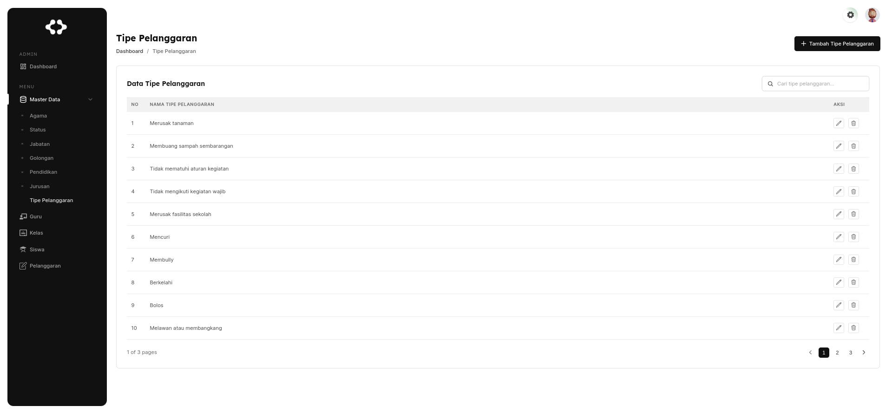

### Guru

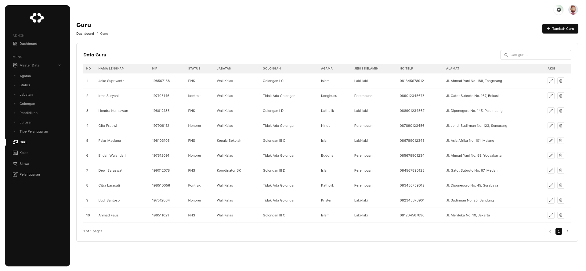

### Kelas

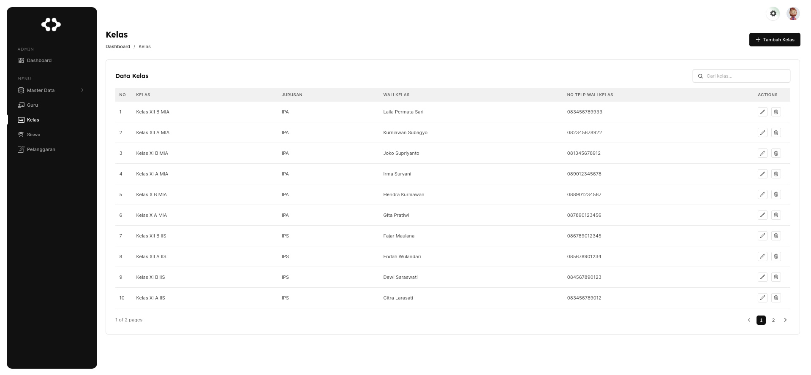

### Siswa

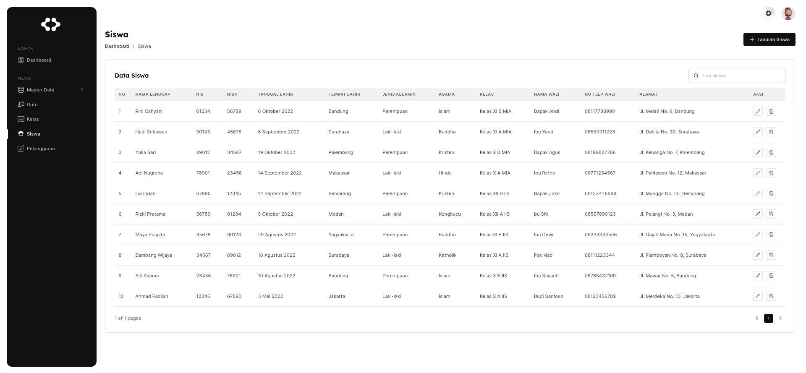

### Pelanggaran

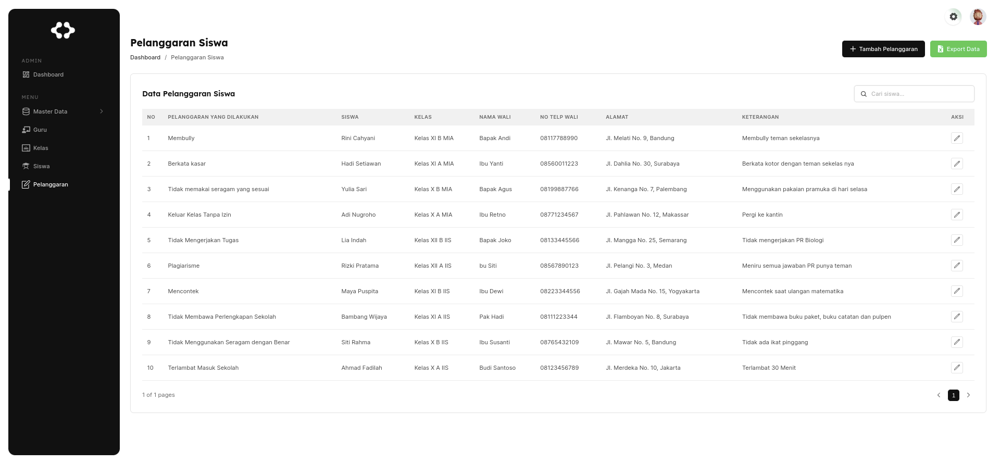

### Update Password

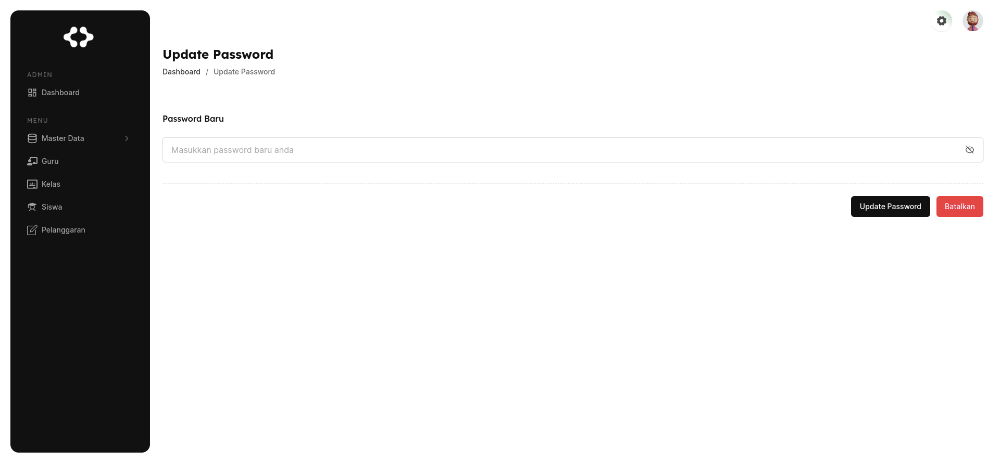
